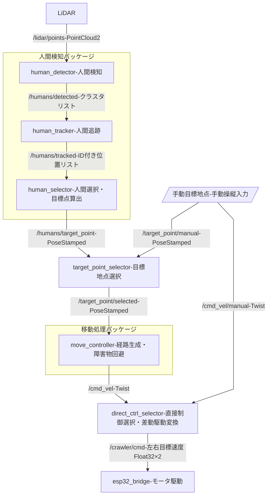

# TMシステム基本設計

## 人間検知パッケージ

### 人間検知（`human_detector`）

LiDARで取得した点群をクラスタリングし、人体形状フィルタを適用することで、検知範囲内の全人物を検出する。出力は各人物の点群クラスタ（または2D/3D位置）のリスト。

### 人間追跡（`human_tracker`）

検出された人物に対してフレーム間でIDを割り当て、継続的に位置を追跡する。カルマンフィルタ等を用いて各IDの現在位置と速度を推定し、ID付き追跡結果のリストを出力する。

### 人間選択（`human_selector`）

追尾対象とする1人を選択し、**追尾目標点**を算出して出力する。追尾目標点は「ロボットと目標人物を結ぶ直線上で、目標人物の手前一定距離」の点であり、ロボット座標系での相対位置として出力する。

## 目標地点選択（`target_point_selector`）

`human_selector` からの追尾目標点と、手動指定トピック（外部オペレータや上位システムからの任意座標）を切り替えるセレクタ。

## 移動処理パッケージ

### 移動制御（`move_controller`）

Nav2等のナビゲーションスタックを利用し、目標地点へ向かう経路を生成・追従する。動的障害物を回避しながら、線速度・角速度の速度指令（`/cmd_vel`）を出力する。

## 直接制御選択（`direct_ctrl_selector`）

`move_controller` からの速度指令と、手動操縦トピックを切り替えるセレクタ。緊急停止や手動介入が必要なときに手動モードへ切り替える。また、線速度・角速度から左右クローラの目標速度への変換（差動駆動変換）もここで行い、`/crawler/cmd` として出力する。

## ESP32（`esp32_bridge`）

`/crawler/cmd` から左右クローラの目標速度を受信し、シリアル通信（またはCANバス）で各モータドライバへPWM信号を送ってモータを駆動する。

---

---

## 主なトピック一覧

| トピック | 型 | 説明 |
| --- | --- | --- |
| `/lidar/points` | `sensor_msgs/PointCloud2` | LiDAR生点群 |
| `/humans/detected` | カスタム | 検出人物クラスタリスト |
| `/humans/tracked` | カスタム | ID付き追跡人物リスト |
| `/humans/target_point` | `geometry_msgs/PoseStamped` | 追尾目標点（ロボット相対） |
| `/target_point/manual` | `geometry_msgs/PoseStamped` | 手動指定目標地点 |
| `/target_point/selected` | `geometry_msgs/PoseStamped` | 選択後の目標地点 |
| `/cmd_vel` | `geometry_msgs/Twist` | 速度指令（線速度・角速度） |
| `/cmd_vel/manual` | `geometry_msgs/Twist` | 手動操縦速度指令 |
| `/crawler/cmd` | `std_msgs/Float32MultiArray` | 左右クローラ目標速度 `[left, right]` m/s |
