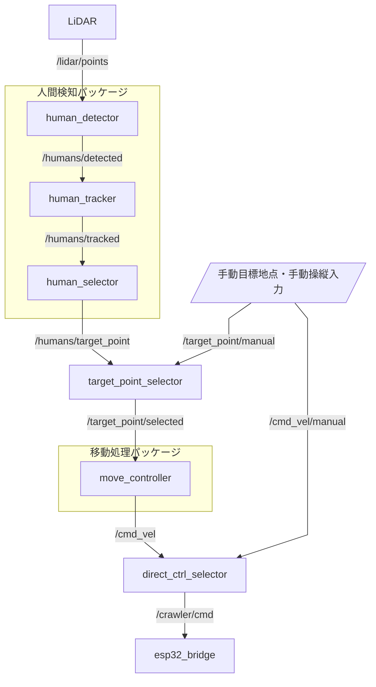

# TMシステム

## 概要

### THシステム

追尾移動ロボットのROS2制御システム。

## システム構成



## パッケージ構成

| パッケージ | 種別 | ノード |
| --- | --- | --- |
| `tm_system_msgs` | カスタムメッセージ定義 | — |
| `human_detection_package` | 人間検知（3ノード） | `human_detector`, `human_tracker`, `human_selector` |
| `motion_control_package` | 移動制御（1ノード） | `move_controller` |
| `tm_system_bringup` | 起動・選択・テスト用 | `target_point_selector`, `direct_ctrl_selector`, `esp32_bridge`, `dummy_lidar_publisher`, `dummy_manual_target_publisher`, `dummy_manual_vel_publisher` |

## トピック一覧

| トピック | 型 | 説明 |
| --- | --- | --- |
| `/lidar/points` | `sensor_msgs/PointCloud2` | LiDAR生点群 |
| `/humans/detected` | `tm_system_msgs/HumanClusterList` | 検出人物クラスタリスト |
| `/humans/tracked` | `tm_system_msgs/TrackedHumanList` | ID付き追跡人物リスト |
| `/humans/target_point` | `geometry_msgs/PoseStamped` | 追尾目標点 |
| `/target_point/manual` | `geometry_msgs/PoseStamped` | 手動指定目標地点 |
| `/target_point/selected` | `geometry_msgs/PoseStamped` | 選択後の目標地点 |
| `/cmd_vel` | `geometry_msgs/Twist` | 速度指令 |
| `/cmd_vel/manual` | `geometry_msgs/Twist` | 手動操縦速度指令 |
| `/crawler/cmd` | `std_msgs/Float32MultiArray` | 左右クローラ目標速度 `[left, right]` |

## ビルド

```bash
cd ros_ws
colcon build
source install/setup.bash
```

## 起動方法

### 全ノード起動（ダミーデータなし）

```bash
ros2 launch tm_system_bringup tm_system_all.launch.py
```

### 全ノード＋ダミーデータ一斉送信（全体動作テスト用）

```bash
ros2 launch tm_system_bringup test_dummy_topics.launch.py
```

### パッケージ個別起動

```bash
# 人間検知パッケージのみ
ros2 launch human_detection_package human_detection_package.launch.py

# 移動制御のみ
ros2 launch motion_control_package motion_control_package.launch.py
```

### ダミーデータパブリッシャを個別実行

```bash
ros2 run tm_system_bringup dummy_lidar_publisher
ros2 run tm_system_bringup dummy_manual_target_publisher
ros2 run tm_system_bringup dummy_manual_vel_publisher
```

## テスト

```bash
cd ros_ws
colcon test
colcon test-result --verbose
```

## 各ノードの入出力

| ノード | 購読トピック | 発行トピック |
| --- | --- | --- |
| `human_detector` | `/lidar/points` | `/humans/detected` |
| `human_tracker` | `/humans/detected` | `/humans/tracked` |
| `human_selector` | `/humans/tracked` | `/humans/target_point` |
| `target_point_selector` | `/humans/target_point`, `/target_point/manual` | `/target_point/selected` |
| `move_controller` | `/target_point/selected` | `/cmd_vel` |
| `direct_ctrl_selector` | `/cmd_vel`, `/cmd_vel/manual` | `/crawler/cmd` |
| `esp32_bridge` | `/crawler/cmd` | （ログ出力のみ） |

## ノードグラフの自動生成（ros2-graph）

システム実行中に以下のコマンドでROS 2ノード間の関係（トピック・サービス・アクション）を
Mermaid形式で出力できます。出力結果はGitHubやVS Codeでそのまま表示できます。

```bash
# Dockerコンテナ内で
source /opt/ros/humble/setup.bash
source /ros_ws/install/setup.bash

# 特定のノードを指定してMermaid出力
ros2_graph /target_point_selector

# 複数ノードをまとめて指定
ros2_graph /target_point_selector /move_controller

# 全ノードをSVG画像として保存
ros2_graph $(ros2 node list) -o rosgraph.svg --outputFormat svg
```

画像出力（SVG/PNG/PDF）には `@mermaid-js/mermaid-cli` が内部で使用され、
コンテナ内のPuppeteer設定により自動的に処理されます。
